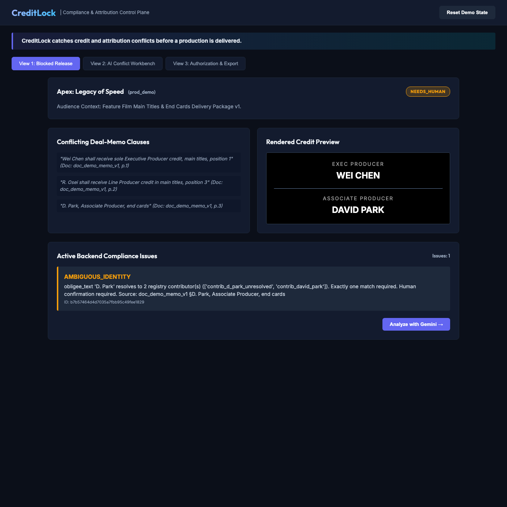
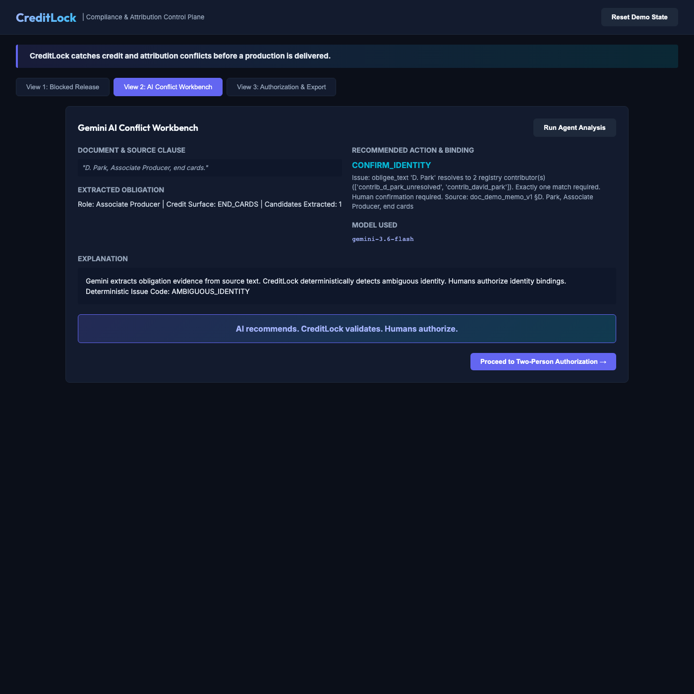
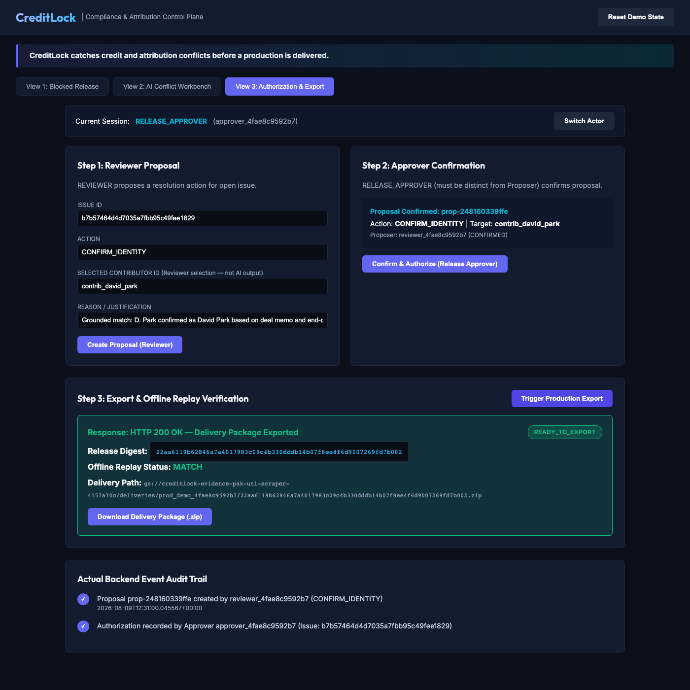
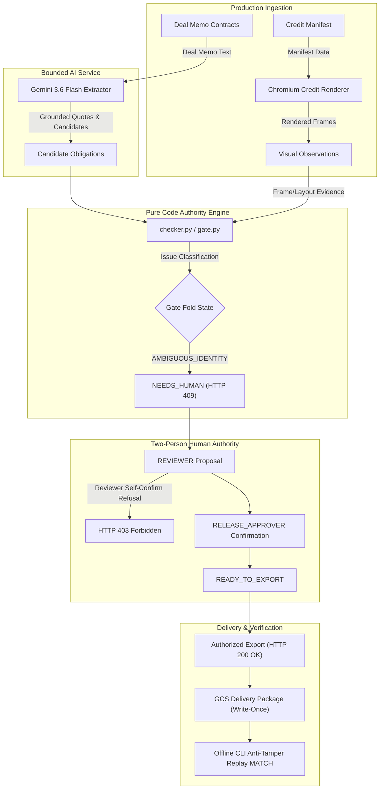

# CreditLock

> **CreditLock protects credit, attribution, and delivery obligations for productions ranging from traditional film and television to indie studios and creator-led media teams.**

[](https://creditlock-fvyx7hpwvq-uc.a.run.app)

**Live Hosted Judge URL:** [https://creditlock-fvyx7hpwvq-uc.a.run.app](https://creditlock-fvyx7hpwvq-uc.a.run.app)

---

## The Problem It Solves

You're delivering a film tonight: the end credits say "D. Park," but two different people in the contributor registry match that name. If you guess wrong, you may delay delivery, pay for another render, or violate someone's negotiated credit. But allowing AI to approve the release creates another risk.

CreditLock stops the release first. Gemini finds the exact deal-memo evidence. A Reviewer proposes the identity, a different Release Approver must confirm it, and the final delivery package can be independently verified.

---

## Central Product Thesis

> **"AI reads the messy evidence. Deterministic code decides whether release is allowed. Distinct humans authorize consequential resolutions."**

**Core Boundary Rule:** *AI recommends. CreditLock validates. Humans authorize.*

---

## The Production Problem

In film, series, and creator media production, credit card rendering and delivery attribution are governed by complex human-authored deal memos.

- **Late Discovery:** Credit and attribution errors are frequently discovered too late—during mastering, delivery, or post-release. Fixing mistakes after delivery can require costly re-renders or risk legal breach claims.
- **Ambiguity & Conflicts:** Deal memos contain inconsistent names, ambiguous aliases, or conflicting placement rules (e.g. "D. Park" vs "David Park").
- **Unsafe AI Automation:** Standard non-deterministic LLM agents cannot safely authorize media release because model hallucinations or non-deterministic outputs can cause silent compliance failures.

---

## The CreditLock Solution

CreditLock establishes a strict architectural boundary where AI handles document intelligence while deterministic code and human authority govern release gates:

1. **Grounded AI Extraction:** Gemini (`gemini-3.6-flash`) parses raw deal memos and extracts candidate obligations grounded with exact source document quotes (`text_content[start:end] == quote`).
2. **Fail-Closed Deterministic Engine:** Pure deterministic checker code (`src/creditlock/domain/checker.py`) evaluates extracted evidence against rendered credit frames and contributor registries, automatically folding findings into unified gate states (`NEEDS_HUMAN`, `BLOCKED`, `READY_TO_EXPORT`).
3. **Two-Person Human Authorization:** Resolving open issues requires a `REVIEWER` to submit a proposal and a distinct `RELEASE_APPROVER` to confirm it. Reviewers cannot self-confirm.
4. **Anti-Tamper Replay Engine:** Exporting an authorized production (`HTTP 200 OK`) produces a delivery ZIP in Google Cloud Storage (GCS), binding the manifest, obligations, render profile, ordered frame hashes, layout evidence, visual observations, deterministic findings, identity bindings, proposals, authorizations, final gate state, and artifact-index digest. The bundle can be deterministically verified offline via CLI replay.

---

## Three-Minute Judge Walkthrough Path

Inspect and operate CreditLock in under three minutes on the hosted judge platform:

```
┌──────────────────────────┐    ┌──────────────────────────┐    ┌──────────────────────────┐
│  1. Blocked Production   │───>│ 2. Gemini AI Workbench   │───>│3. Two-Person Sign-Off    │
│  HTTP 409 / NEEDS_HUMAN  │    │ Grounded Quote Extraction│    │  403 Refusal → 200 Export│
└──────────────────────────┘    └──────────────────────────┘    └──────────────────────────┘
                                                                              │
┌──────────────────────────┐                                                  ▼
│   5. Offline Replay      │<───────────────────────────────────────┐ 4. GCS Delivery Package  │
│  CLI Verification: MATCH │                                        │ anti-tamper .zip in GCS  │
└──────────────────────────┘                                        └──────────────────────────┘
```

1. **Blocked Production UI (`HTTP 409`):** Open [Live Demo](https://creditlock-fvyx7hpwvq-uc.a.run.app). View 1 shows production *Apex: Legacy of Speed* in `NEEDS_HUMAN` gate state. The deal memo specifies "D. Park", triggering a deterministic `AMBIGUOUS_IDENTITY` issue. Attempting export returns `HTTP 409 Conflict`.
2. **Gemini Conflict Workbench:** Switch to View 2 and click **Run Agent Analysis**. Gemini 3.6 Flash extracts candidate obligations grounded by exact document quotes (*"D. Park, Associate Producer, end cards"*).
3. **Two-Person Authorization (`403 -> 200`):** Switch to View 3 as `REVIEWER` and submit a proposal for David Park. Attempting reviewer self-confirmation returns `HTTP 403 Forbidden`. Click **Switch Actor** to `RELEASE_APPROVER` and confirm the proposal. Gate status transitions to `READY_TO_EXPORT`.
4. **Authorized GCS Export (`HTTP 200 OK`):** Trigger export as `RELEASE_APPROVER`. The backend returns `HTTP 200 OK` and writes the delivery package (binding manifest, obligations, render profile, frame hashes, visual observations, deterministic findings, identity bindings, proposals, authorizations, gate state, and artifact-index digest) to Google Cloud Storage.
5. **Offline Replay Verification:** Download the `.zip` bundle and verify it offline via `.venv/bin/python scripts/replay.py <path_to_delivery_package.zip> --expected-release-digest <release_digest>`, yielding `MATCH`.





---

## System Architecture



---

## What AI Does vs. What AI Cannot Do

### What AI Does
- Parses inconsistent, human-authored deal memo clauses.
- Extracts candidate obligations (`status = CANDIDATE`).
- Grounds candidate extractions to exact source quotes (`text_content[start:end] == quote`).
- Recommends resolution targets for human review.

### What AI Cannot Do
- AI **cannot** activate obligations or clear open compliance issues.
- AI **cannot** modify gate states (`NEEDS_HUMAN`, `BLOCKED`, `READY_TO_EXPORT`).
- AI **cannot** authorize production exports or bypass human sign-offs.
- AI **cannot** bypass NFC canonical hash-binding or role security checks.

---

## Google Cloud Technologies

- **Gemini Enterprise Configuration:** Live `gemini-3.6-flash` model via official `google.genai` SDK with strict Pydantic structured output validation (`extra="forbid"`).
- **Cloud Run:** Hosted serverless production container execution (revision `creditlock-00024-4h2` at image `creditlock-c2@sha256:ae19b5350bc8bbc83f593454b8bcf6f2e6608ac75b2e5504ea33e3fceaf6f745`).
- **Google Cloud Storage (GCS):** Application-enforced create-only/write-once delivery objects store generated release delivery packages and frame/package artifacts.
- **Firestore:** Production transactional state store. The hosted Cloud Run instance uses the Firestore production store for persistent production state.
- **Secret Manager:** Runtime retrieval of JWT signing secret keys.
- **Confluent Cloud:** The hosted export flow emits a `resolution.recorded` event through Confluent Cloud Kafka. A warm worker subscribes to the topic and projects the event into Firestore; the UI displays `Confluent Cloud`, event type `resolution.recorded`, and `Firestore projection: SYNCHRONIZED` after a successful authorized export.

---

## IBM Track & IBM Bob Usage

IBM Bob was used meaningfully during CreditLock development. Bob assisted with scaffolding Pydantic v2 domain models, building NFC-normalized canonical hashing logic, implementing identity classification rules, writing unit test suites, and constructing Kafka event transport logic. Bob implemented the final hosted judge-journey verifier (`scripts/verify_judge_journey.py`), confirmed at commits `5f968444cb383a14967d99e4375d8782d65a7373` and `5b317032f554af384d79b0cfee4862146a20f5b4`. The verifier confirmed 15/15 mandatory hosted steps passed with offline replay returning MATCH. Bob's development contributions are `VERIFIED_LOCAL`; the verifier itself exercised a `HOSTED_VERIFIED` journey. Bob's work is preserved in the development log and commits.

Bob did not write every component of CreditLock. Later persistence, event-sync, delivery-determinism, and CSS work were contributed by other permitted means and must not be misattributed to Bob.

Full development log: [`docs/bob-development-log.md`](docs/bob-development-log.md)

Final hosted transcript: [`docs/evidence/final-hosted-judge-journey.txt`](docs/evidence/final-hosted-judge-journey.txt)

**Confluent:** CreditLock integrates Confluent Cloud event transport, developed with IBM Bob and verified through a recorded live produce/consume round trip on partition 0 of Confluent Cloud Kafka cluster (`topic: creditlock.production.events`). The hosted export flow emits the `resolution.recorded` event through Confluent Cloud; a warm worker projects it into Firestore.

---

## Honest Hosted Demo Disclosure

- **Synthetic Data:** The demo uses synthetic enterprise-shaped production data. It is not evidence of customer adoption.
- **Persistent State:** The hosted Cloud Run instance uses the Firestore production store. Exported GCS delivery packages persist beyond the session.
- **Event Sync:** Authorized exports emit `resolution.recorded` events through Confluent Cloud. A warm worker projects them into Firestore; the UI shows `Firestore projection: SYNCHRONIZED` on success.
- **Offline Replay:** Replay verification is `VERIFIED_LOCAL` against a bundle produced by the hosted journey.
- **Demo Concurrency:** The demo environment is configured for single-instance judge walkthrough.

---

## Local Setup & Offline Replay Instructions

Run locally from a clean checkout:

```bash
# 1. Clone repository & create virtual environment
python3 -m venv .venv
source .venv/bin/activate

# 2. Install editable package with dev dependencies
pip install -e ".[dev]"

# 3. Run full unit and integration test suite
pytest -q

# 4. Run deterministic benchmark suite
python scripts/run_evaluation.py --output-dir reports/

# 5. Start local API dev server
uvicorn creditlock.api.app:app --reload
```

### Replay Exported Package Offline

To verify an exported delivery bundle without cloud credentials:

```bash
.venv/bin/python scripts/replay.py \
  <path_to_delivery_package.zip> \
  --expected-release-digest <release_digest>
```

---

## Documentation & Evidence Links

- Claim-to-Evidence Matrix: [`docs/claim-to-evidence.md`](docs/claim-to-evidence.md)
- IBM Bob Development Log: [`docs/bob-development-log.md`](docs/bob-development-log.md)
- Final Hosted Transcript: [`docs/evidence/final-hosted-judge-journey.txt`](docs/evidence/final-hosted-judge-journey.txt)
- Runtime File Hash Manifest: [`docs/RUNTIME-FILE-SHA256.txt`](docs/RUNTIME-FILE-SHA256.txt)

---

## License

[Apache-2.0](LICENSE)
